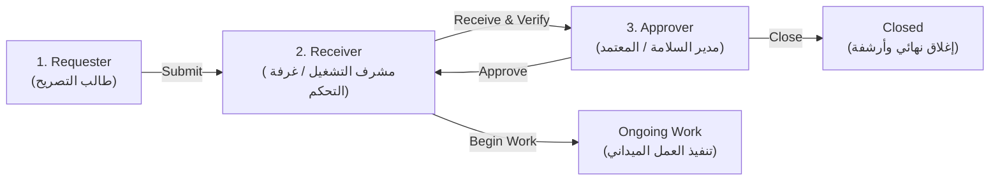
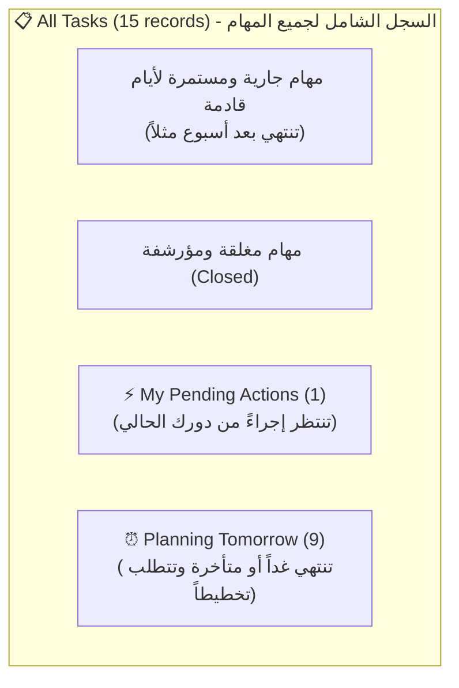

# دليل النظام وعرض المشروع الشامل — PRTCMS ERP
### Petroleum Refinery Task & Certificate Management System
> نظام إدارة تصاريح العمل وشهادات السلامة الرقمية للمنشآت البترولية والصناعية

---

## الفهرس (Table of Contents)
1. [نبذة عامة عن المشروع والقيمة الهندسية](#1-نبذة-عامة-عن-المشروع-والقيمة-الهندسية)
2. [الأدوار ومصفوفة الصلاحيات (Roles & Permissions)](#2-الأدوار-ومصفوفة-الصلاحيات-roles--permissions)
3. [دورة حياة التصريح ومسار الحالة (State Machine / Workflow)](#3-دورة-حياة-التصريح-ومسار-الحالة-state-machine--workflow)
4. [شرح التبويبات الثلاثة في سجل المهام (Tasks Views)](#4-شرح-التبويبات-الثلاثة-في-سجل-المهام-tasks-views)
5. [أقسام وشاشات النظام بالتفصيل (System Screens)](#5-أقسام-وشاشات-النظام-بالتفصيل-system-screens)
6. [شهادات السلامة وإدارتها (Safety Certificates)](#6-شهادات-السلامة-وإدارتها-safety-certificates)
7. [سيناريو العرض التقديمي الموصى به أمام المهندس (Live Demo Pitch Script)](#7-سيناريو-العرض-التقديمي-الموصى-به-أمام-المهندس-live-demo-pitch-script)

---

## 1. نبذة عامة عن المشروع والقيمة الهندسية

* **اسم النظام:** **PRTCMS ERP** (*Petroleum Refinery Task & Certificate Management System*)
* **طبيعة المنشأة:** مجمع تكرير وبتروكيماويات (*Refinery Complex Alpha*).
* **المشكلة التي يحلها النظام:**
  * في المنشآت الصناعية والبترولية، تنفيذ أي عمل (لحام، دخول أماكن مغلقة، حفر، عزل كهربائي) يتطلب تصريح عمل صارم (**Permit-to-Work - PTW**).
  * النظام التقليدي الورقي يسبب بطء الإجراءات، ضياع المستندات، صعوبة التتبع، ومخاطر حوادث في حال بدء العمل قبل استيفاء اشتراطات السلامة.
* **الحل والقيمة المضافة (Value Added):**
  1. **رقمنة دورة التصاريح بالكامل:** من مرحلة الطلب وحتى الإغلاق والأرشفة.
  2. **حوكمة رقمية مشددة (Strict Governance):** منع اتخاذ أي إجراء إلا من صاحب الصلاحية المحددة.
  3. **ربط التصاريح بشهادات السلامة:** التحقق التلقائي واليدوي من شهادات الغاز، ومراقبة الحريق، والعزل الكهربتائي والميكانيكي.
  4. **سجل تدقيق كامل وغير قابل للتعديل (Immutable Audit Trail):** تسجيل كل نقرة وقرار بالوقت، التاريخ، اسم المشغل، والسبب.

---

## 2. الأدوار ومصفوفة الصلاحيات (Roles & Permissions)

النظام مبني على **4 أدوار وظيفية (Roles)** تغطي الهيكل التنظيمي للمحطة:

### تفصيل كل دور وظيفي:

### 1. طالب التصريح (Requester)
* **من هو؟** الفني الميداني، مقاول العمل، أو مهندس الصيانة (*Field Operator / Maintenance Engineer*).
* **مسؤولياته:** رفع طلبات العمل وتحديد منطقة العمل وتاريخ البدء والانتهاء.
* **صلاحياته المباشرة:**
  * `Create Task`: إنشاء مسودة تصريح جديد.
  * `Submit`: إرسال التصريح لغرفة التحكم.
  * `Clone`: استنساخ تصريح قديم متكرر لتوفير الوقت.
* **مهامه المعلقة (`My pending actions`):** المهام في حالة `created` (مسودات لم تُرسل) أو `returned` (أُرجعت له بملاحظات للتعديل).

---

### 2. مستلم العمل (Receiver)
* **من هو؟** مهندس العمليات أو مشرف غرفة التحكم (*Control-Room Staff / Shift Supervisor*).
* **مسؤولياته:** التأكد من جاهزية الموقع، عزل خطوط الإنتاج، وتدقيق شهادات السلامة قبل رفعها للاعتماد.
* **صلاحياته المباشرة:**
  * `Receive`: استلام الطلب رسمياً وتأكيد مراجعة الموقع.
  * `Verify Certificate`: التحقق اليدوي من شهادات السلامة ونتائج تحليل الغاز.
  * `Begin Work`: إعطاء الإشارة ببدء العمل الفعلي بعد صدور الاعتماد ونقل المهمة إلى `Ongoing`.
  * `Clone`: استنساخ المهام.
* **مهامه المعلقة (`My pending actions`):** كل الطلبات الجديدة المقدمة بحالة `submitted` أو `pending`.

---

### 3. المعتمد (Approver)
* **من هو؟** مدير إدارة السلامة والصحة المهنية (HSE Manager) أو مدير عام العمليات بالمحطة (*Senior Operations Authority*).
* **مسؤولياته:** اتخاذ القرار النهائي بالموافقة أو الرفض استناداً لمعايير السلامة العالمية.
* **صلاحياته المباشرة:**
  * `Approve`: الاعتماد النهائي للتصريح.
  * `Reject`: رفض التصريح رفضاً قاطعاً مع إدخال سبب الرفض الإلزامي.
  * `Return`: إرجاع التصريح للمعدّل مع إبداء الملاحظات والنواقص.
  * `Close`: إغلاق التصريح وأرشفته بعد انتهاء الأعمال الميدانية وتسليم الموقع.
  * `Verify Certificate`: تدقيق الشهادات.
* **مهامه المعلقة (`My pending actions`):** المهام التي راجعها الـ Receiver وأصبحت جاهزة للاعتماد النهائي بحالة `received`.

---

### 4. مسؤول النظام (Administrator)
* **من هو؟** مدير النظام ومسؤول تقنية المعلومات والحوكمة (*System Admin*).
* **صلاحياته:**
  * يمتلك جميع الصلاحيات الـ 12 في النظام.
  * **صلاحيات حصرية:** الوصول إلى سجل التدقيق العام للنظام بالكامل (**System Audit History**)، إدارة المستخدمين، إلغاء التصاريح (`Cancel`)، وتصدير التقارير.
* **مهامه المعلقة (`My pending actions`):** جميع المهام المفتوحة والنشطة في المحطة.

---

### جدول مصفوفة الصلاحيات (Authorization Matrix):

| الصلاحية (Action) | الوصف | Requester | Receiver | Approver | Admin |
| :--- | :--- | :---: | :---: | :---: | :---: |
| **Create Task** | إنشاء طلب تصريح جديد | ✅ | ❌ | ❌ | ✅ |
| **Submit** | تقديم الطلب للمراجعة | ✅ | ❌ | ❌ | ✅ |
| **Receive** | استلام الطلب وتجهيزه | ❌ | ✅ | ❌ | ✅ |
| **Approve** | الاعتماد النهائي للتصريح | ❌ | ❌ | ✅ | ✅ |
| **Begin Work** | بدء التنفيذ الميداني | ❌ | ✅ | ❌ | ✅ |
| **Return** | إرجاع للتعديل مع سبب | ❌ | ❌ | ✅ | ✅ |
| **Reject** | رفض نهائي مع سبب | ❌ | ❌ | ✅ | ✅ |
| **Close** | إغلاق وأرشفة التصريح | ❌ | ❌ | ✅ | ✅ |
| **Cancel** | إلغاء التصريح | ❌ | ❌ | ❌ | ✅ |
| **Clone Task** | استنساخ المهمة | ✅ | ✅ | ❌ | ✅ |
| **Verify Cert** | توثيق وتدقيق الشهادات | ❌ | ✅ | ✅ | ✅ |
| **Audit History** | عرض سجل التدقيق الشامل | ❌ | ❌ | ❌ | ✅ |

---

## 3. دورة حياة التصريح ومسار الحالة (State Machine / Workflow)

### المسار الطبيعي الأساسي (Main Happy Path):
1. **`Created` (تم الإنشاء):** تصريح جديد أنشأه طالب التصريح كمسودة.
2. **`Submitted` (تم التقديم):** أُرسل الطلب رسمياً وينتظر استلام غرفة التحكم.
3. **`Received` (تم الاستلام):** استلمه مهندس التشغيل وتأكد من شهادات الموقع وجهّزه للاعتماد.
4. **`Approved` (تم الاعتماد):** اعتمده مدير السلامة وأصبح مصرحاً به قانونياً.
5. **`Ongoing` (قيد التنفيذ):** بدأ الفنيون العمل الفعلي في الموقع.
6. **`Closed` (مُغلق):** انتهت الأعمال بالكامل وأُغلق التصريح وأصبح للقراءة فقط.

### المسارات الفرعية والاستثنائية (Branch States):
* **`Returned` (مُرتجع):** أرجعه المعتمد لوجود نواقص (يطلب النظام كتابة سبب الإرجاع ويتحول التصريح لصندوق وارد الـ Requester لتعديله).
* **`Rejected` (مرفوض):** رُفض الطلب لمخاطر جسيمة مع تسجيل سبب الرفض في سجل التدقيق.
* **`Expired` (منتهي الصلاحية):** انتهت فترة صلاحية التصريح دون تمديد أو إغلاق (حالة نهائية لا يمكن إعادة فتحها للحفاظ على الأمان).
* **`Cancelled` (مُلغى):** تم إلغاؤه بقرار إداري.

---

## 4. شرح التبويبات الثلاثة في سجل المهام (Tasks Views)

| التبويب | المفهوم الرياضي والتشغيلي | متى تستخدمه؟ |
| :--- | :--- | :--- |
| **All tasks** | **المجموعة الشاملة (Master List):** يعرض كل مهام وتصاريح المنشأة لجميع الأدوار والأقسام لتحقيق الشفافية الكاملة. | للبحث، الفلترة حسب الأقسام أو الأنواع، ومتابعة السجل العام. |
| **My pending actions** | **صندوق الوارد الذكي (Actionable Inbox):** فلتر مخصص يعرض فقط المهام التي تقف عند دورك أنت وتحتاج لتوقيعك أو قرارك. | لبدء يوم العمل وإنجاز المهام المطلوبة منك دون تشتت. |
| **Planning tomorrow** | **التخطيط الوقائي للوردية (Shift Planning):** فلتر يعزل المهام التي ينتهي تاريخ صلاحيتها غداً أو قبله (`validityEnd <= TOMORROW`) ويرتبها حسب الأولوية والاستعجال. | لمشرفي الوردية لضمان تجديد التصاريح الموشكة على الانتهاء ومنع توقف العمليات. |

---

## 5. أقسام وشاشات النظام بالتفصيل (System Screens)

1. **شاشة تسجيل الدخول (`/`):**
   * تتيح اختيار الدور والمشغل (Requester, Receiver, Approver, Admin) لتجربة النظام ومحاكاة الصلاحيات بسهولة.
2. **لوحة المؤشرات التشغيلية (`/dashboard`):**
   * بطاقات مؤشرات الأداء (KPIs): مهام بانتظار الإجراء، أوامر العمل النشطة، مهام توشك على الانتهاء، شهادات تحتاج لتدقيق.
   * قائمة انتظار التدخل السريع (**Critical Action Queue**) لأهم 6 مهام مستعجلة.
3. **سجل المهام والتصاريح (`/tasks`):**
   * شريط أدوات متطور يحتوي على: البحث الفوري، فلترة الأقسام، فلترة أنواع التصاريح، فلترة الحالات.
   * 5 خيارات فرز مستقلة (أبجدي A-Z، تاريخ التقديم، تاريخ الانتهاء، آخر تحديث، رقم المهمة).
   * عرض متجاوب بالكامل (جدول بيانات للشاشات الكبيرة + بطاقات تفاعلية للهواتف).
4. **شاشة تفاصيل التصريح (`/tasks/[id]`):**
   * شريط مسار الحالة التفاعلي (**Workflow Pipeline Visualizer**).
   * أزرار اتخاذ القرار الديناميكية (تتغير تلقائياً حسب الدور وحالة التصريح الحالية).
   * جدول الشهادات المرفقة وإمكانية التحقق منها.
   * سجل الملاحظات والتعليقات الميدانية المباشرة (**Remarks**).
   * سجل الحركات التدقيقي للمهمة (**Action History**).
5. **سجل شهادات السلامة (`/certificates`):**
   * جدول بجميع الشهادات الميدانية مع نافذة التحقق اليدوي (**Manual Verification Modal**).
6. **مصفوفة الصلاحيات والحوكمة (`/roles`):**
   * عرض بصري لنسب الصلاحيات لكل دور وجدول مقارنة تفصيلي.
7. **سجل التدقيق الشامل للنظام (`/history`):**
   * شاشة خاصة بالـ Admin تعرض سجلاً زمنياً شاملاً لكل تعديل أو اعتماد أو رفض حدث في المنشأة مع إمكانية الفلترة بالموظف أو الإجراء أو التاريخ.

---

## 6. شهادات السلامة وإدارتها (Safety Certificates)

يتكامل كل تصريح عمل مع 4 أنواع رئيسية من الشهادات الإلزامية:
1. **Gas Test Certificate (GTC):** شهادة فحص تركيز الغازات السامة والقابلة للاشتعال ونسبة الأكسجين.
2. **Fire Watch Authorization (FWA):** تصريح تعيين مراقب حريق معتمد لأعمال اللحام والحرارة.
3. **Electrical Isolation Certificate (EIC):** شهادة فصل وتأمين التيار الكهربائي (Lockout/Tagout).
4. **Mechanical Isolation Certificate (MIC):** شهادة عزل وتفريغ الصمامات والخطوط الميكانيكية.

---

## 7. سيناريو العرض التقديمي الموصى به أمام المهندس (Live Demo Pitch Script)

اتبع هذه الخطوات بالترتيب أثناء تقديم العرض:

1. **المقدمة (30 ثانية):**
   > "نظامنا هو PRTCMS ERP، منصة لإدارة تصاريح العمل وشهادات السلامة في المنشآت الصناعية لحوكمة العمليات الخطرة وضمان عدم بدء أي عمل دون دورة اعتماد رقمية محكمة."

2. **استعراض الـ Dashboard:**
   > "في لوحة المؤشرات، نوفر للمشرف رؤية فورية للوردية الحالية: المهام النشطة، والشهادات غير الموثقة، والتصاريح التي تنتهي غداً لمنع توقف العمل."

3. **استعراض التبويبات الثلاثة في سجل المهام (`/tasks`):**
   > "لدينا في سجل المهام:
   > - `All tasks`: السجل الشامل المفتوح لجميع التصاريح لتحقيق الشفافية.
   > - `My pending actions`: صندوق وارد ذكي يعزل فقط المهام المعلقة على دور المستخدم الحالي.
   > - `Planning tomorrow`: فرز استباقي للمهام العاجلة لوردية الغد."

4. **تطبيق تجربة عملية حية (Live Interactive Workflow):**
   * ادخل بدور **Requester (Ahmed Al-Rashidi)** $\rightarrow$ اضغط **New Task** وأنشئ تصريحاً جديداً ثم اضغط **Submit**.
   * بدّل الدور إلى **Receiver (Samir Okafor)** $\rightarrow$ ادخل على **My pending actions** وافتح التصريح، ثم اضغط **Receive** ودقق شهادة الغاز.
   * بدّل الدور إلى **Approver (Col. James Harrington)** $\rightarrow$ افتح التصريح واعتمد القرار بالضغط على **Approve**.
   * افتح أسفل الصفحة وأرِ المهندس **Action History** وكيف تم تسجيل حركة كل مستخدم بالثانية في الـ Audit Log.
   * ادخل بدور **Admin** وأره شاشة **System History** ومصفوفة **Roles & Permissions**.
